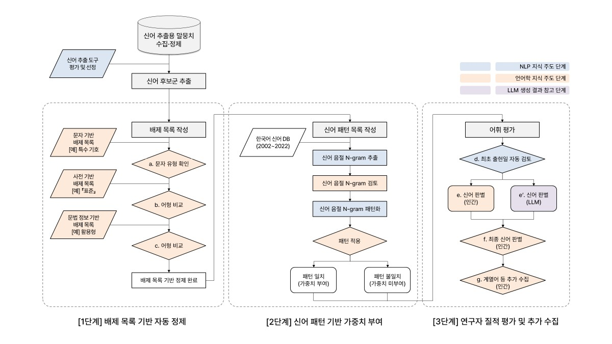

# 🌱 K-NEOBENCH: 현대 한국어 신어 벤치마크

## 1. 개요

**K-NEOBENCH**는 2020년 이후 한국 주요 언론 매체에 최초로 출현한 신어 1,378개를 한국어 사전 형식으로 기술한 벤치마크 데이터입니다.  
각 신어에 대해 다음과 같은 정보를 제공합니다:

- 최초 출현 연도별 색인표제어 및 등재표제어
- 원어, 어종, 품사, 전문분야 정보 포함
- 한국어 말뭉치언어학 및 사전학 전문가의 검토를 거쳐 수집

## 2. 벤치마크 평가 항목

### 1) 신어 탐지의 정확도와 재현율
- 2020년 이후 한국 사회에 최초로 출현한 **형태적 신어**(**단어와 구**)에 대한 탐지 성능 평가

### 2) 형태적 특성
- 단일어, 복합어(합성어, 파생어, 혼성어, 축약어) 등 **조어 유형**
- 고유어, 한자어, 외래어 등 **구성 요소의 어종** 식별 정확도

### 3) 의미 범주 분류
- 신어가 출현한 **의미 영역** 분류 정확성
- *(정치와 행정, 경제생활, 의생활, 식생활, 주생활, 보건·의학 등 총 13개 범주)*

### 4) 뜻풀이와 용례 평가
- 각 신어의 **뜻풀이 정확성**
- 각 신어의 **용례 정확성**
> **※ 참고:** 뜻풀이 및 용례는 모델 평가의 핵심 정보이므로 공개 데이터에는 포함되어 있지 않습니다. 전체 데이터가 필요하신 경우 아래의 연락처로 문의해 주시기 바랍니다. 😊

### 5) 화용적 정보
- **혐오‧차별 표현 여부**에 대한 평가

## 3. 벤치마크의 구조

| 데이터 필드       | 예시                 | 설명 |
|------------------|----------------------|------|
| `IDX`            | `2020-0244`       | 고유 번호 |
| `최초 출현 연도` | `2020`       | 해당 신어가 최초로 출현한 연도 |
| `색인표제어`     | `요린이` | 사전 색인용 형태 |
| `등재표제어`     | `요린이` | 사전 등재용 형태 |
| `조어 유형`      | `복합어(혼성어)`   | 단일어 및 복합어(합성어, 파생어, 혼성어, 축약어)의 조어 유형 |
| `원어`           | `(料린이)` | 신어 구성 요소의 원어 표기 |
| `어종`           | `한+고` | 신어 구성 어휘의 어종(고유어, 한자어, 외래어) |
| `품사`           | `「명」`  | 신어의 품사 정보 |
| `전문 분야`      | `` | 신어가 출현한 전문 분야 |
| `의미 영역`      | `삶` | 신어가 빈번하게 사용되는 의미 영역 |
| `X년 Y월 신어`   | `[2019년 9월 신어]` | <네이버 뉴스> 기준의 신어 최초 출현 시점(YYYYMM) |

## 4. 벤치마크의 구축 과정

## 5. 한국어 신어의 사용 추이 (*forthcoming*)

한국어 신어의 실제 사용 빈도와 추이는 다음의 별도 저장소를 참고해 주시기 바랍니다.
말뭉치 기반 연도별 상대 빈도 추이, 구글 트렌드 검색 관심도 변화 등을 분석한 결과가 포함되어 있습니다.

📊 **한국어 신어 사용 추이 저장소**  
👉 [K-NEOBENCH-TREND](https://github.com/Jees-an/K-NEOBENCH-TREND)

## 6. 참고문헌

- 남길임·이수진·안진산(2025), 「말뭉치, LLMs, 인간 전문가의 협업을 통한 한국어 신어의 탐지」, 『한국어학』 108호 (*forthcoming*).
- 남길임 외(2021), 『신어 2020』, 한국문화사.
- 남길임 외(2022), 『신어 2021』, 한국문화사.
- 남길임 외(2023), 『신어 2022』, 한국문화사.
- 남길임 외(2024), 『신어 2023』, 한국문화사.
- 남길임 외(2025), 『신어 2024』, 한국문화사 (*forthcoming*).

---

## 💾 전체 데이터 요청

전체 데이터(뜻풀이 및 용례 포함)는 어뷰징 방지를 위해 공개하지 않으며, 연구 목적의 사용은 아래 이메일로 요청해 주시기 바랍니다! 😊

📧 **문의: [san@knu.ac.kr]**

---

## 🧑‍🏫 주요 기여자

- **남길임**
  연세대학교 국어국문학과 교수
  📧 nki@yonsei.ac.kr

- **이수진**
  경북대학교 국어국문학과 외래교수 | 언어정보연구센터 선임연구원
  📧 sjmano27@knu.ac.kr

- **안진산**
  경북대학교 국어국문학과 외래교수 | 언어정보연구센터 연구원
  📧 san@knu.ac.kr

- 본 벤치마크에 포함된 **2020년 이후 한국어 신어 조사 작업**은 **경북대학교 언어정보연구센터**에서 수행하였습니다.
🔗 [언어정보연구센터 홈페이지](https://home.knu.ac.kr/HOME/corpus/)

---

## 🙌 지금까지 기여해 주신 분들

다음 전문가 분들이 신어의 수집, 집필, 분석에 기여해 주셨습니다:

- 송현주(경북대학교 국어교육과 교수)
- 최  준(전남대학교 국어국문학과 교수)
- 현영희(경북대학교 국어국문학과 외래교수)
- 서은영(경북대학교 국어국문학과 외래교수)
- 백미경(경북대학교 국어국문학과 외래교수)
- 강범일(연세대학교 언어정보연구원 연구교수)  
- 고예린(전남대학교 국어국문학과 박사과정)  
- 성민규(연세대학교 국어국문학과 박사과정)   
- 정희윤(NHN 연구원)  
- 김해은(국립국어원 연구원)
- 이  준(연세대학교 국어국문학과 석사과정)  
- 남궁설(연세대학교 국어국문학과 석사과정)  

모든 기여자 여러분께 깊이 감사드립니다.
